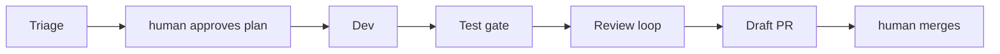

# Architecture

Cue is a deterministic Bun + TypeScript runner. Headless coding agents sit **inside** pipeline stages. Routing, gating, retries, and label transitions are **plain code** — never ask the model something a script can decide (for example, whether tests passed).



GitHub is the state store: `agent:*` labels are the state machine, issue comments carry the plan, draft PRs are the output.

## Layout

```
src/
├── cli.ts              # entrypoint + label definitions; builds the real StageContext
├── pipeline.ts         # nextAction (label → stage), runIssue (failure → agent:failed), process loop
├── cleanup.ts          # merged/closed PRs → agent:done / agent:failed + worktree removal
├── stages/
│   ├── context.ts      # StageContext — DI bundle every stage receives
│   ├── triage.ts       # read-only plan generation; PLAN_MARKER
│   ├── replan.ts       # plan revision from human comments (has WebSearch)
│   ├── dev.ts          # worktree implementation + gate + draft PR
│   └── review.ts       # JSON verdict + bounded fix loop
├── adapters/
│   ├── types.ts        # AgentAdapter / AgentRunOptions (access, webSearch, bashAllowlist) / AgentResult
│   ├── base.ts         # JsonlAdapter: shared env scrub + exec + JSONL parse + progress loop
│   ├── registry.ts     # ADAPTERS: name → { make, defaultModels }
│   ├── summarize.ts    # shared tool-input summarizer (adapters + dashboard transcript)
│   ├── antigravity.ts  # agy -p --output-format stream-json --dangerously-skip-permissions
│   ├── claude.ts       # claude -p --output-format stream-json --verbose; maps access → --allowedTools
│   └── codex.ts        # codex exec --json; sandbox read-only / workspace-write; --search
├── server.ts           # cue ui: Bun.serve, SSE, process/run triggers
├── github.ts           # typed wrapper over the gh CLI
├── worktree.ts         # git worktree per issue; bootstraps empty repos
├── gates.ts            # deterministic test/lint runner (sh -c in the worktree)
├── exec.ts             # THE ONLY place Bun.spawn is called
├── config.ts           # valibot schema + resolveConfig
└── log.ts              # transcripts + cost under <target>/.cue/runs/<issue>/
prompts/                # packaged default role prompts
ui/                     # dashboard SPA, built to ui/build/client
tests/                  # one file per module + integration.test.ts
```

## Invariants

These are load-bearing. Tests encode most of them.

- **All subprocess execution goes through `Exec` in `src/exec.ts`.** Never call `Bun.spawn` anywhere else — that is what makes every module testable.
- **Lean dependencies.** The CLI runtime is valibot-only. The dashboard is a separate package (`ui/package.json`); its deps never enter the CLI.
- **Label names are exact:** `agent:ready`, `agent:planned`, `agent:approved`, `agent:replan`, `agent:in-dev`, `agent:in-review`, `agent:done`, `agent:failed`, `agent:stop`.
- **Plan-comment marker is exactly `<!-- cue:plan -->`** (`PLAN_MARKER` in `stages/triage.ts`). Dev and replan find plans by the newest comment containing it.
- **Branch naming:** `agent/issue-<number>`.
- **The GitHub token must never reach agent subprocesses.** `ClaudeAdapter`, `CodexAdapter`, and `AntigravityAdapter` build scrubbed envs from an allowlist. Tests assert `GH_TOKEN` is absent.
- **Agents never run git/gh side effects.** The runner owns commit, push, PR creation, and labels. Cue never merges and never touches the base branch.
- **Humans gate two moments:** plan approval and PR merge. Do not automate either.
- **Issue bodies and comments are untrusted input.** Every prompt states this.

## How processing works

1. `cleanup` reconciles PRs that have been merged or closed since the last run.
2. `nextAction` maps the issue's labels to a stage (`triage` / `replan` / `dev`).
3. `runIssue` invokes that stage. On throw, it comments the error and applies `agent:failed`.
4. Stages emit through `ctx.onEvent`. The CLI prints events; `cue ui` also broadcasts them over SSE.

`runIssue` is the single place that turns a stage error into an issue comment plus `agent:failed`.

## Adapters

Codex is the default adapter and runs via `codex exec --json`; read-only stages use Codex's `read-only` sandbox and implementation stages use `workspace-write`. Antigravity runs via `agy -p --output-format stream-json --dangerously-skip-permissions`. Claude Code remains available via `claude -p --output-format stream-json --verbose`. All adapters scrub their environments, retaining only their own authentication variables and never `GH_TOKEN`. If a CLI update breaks an adapter, check that CLI's `--help` output first.

## Releases

Push a `v*` tag. `.github/workflows/release.yml` runs `scripts/build-binaries.sh`, which:

1. Builds the dashboard
2. Regenerates the UI embed manifest from `ui/build/client`
3. Compiles per-target binaries into `dist/`
4. Restores the committed empty manifest stub

Release assets are `dist/cue-*` plus `checksums.txt`. `install.sh` at the repo root is the checksum-verified installer.

Prompts embed via `with { type: "file" }` imports in `src/embedded.ts`. New disk assets (prompts, UI output) must join this embedding path or compiled installs break. Never commit a generated UI manifest.

More contributor workflow: [Contributing](/develop/contributing).
