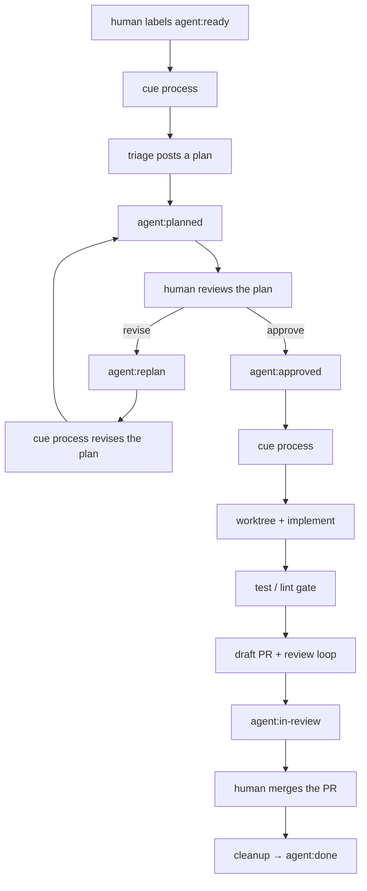
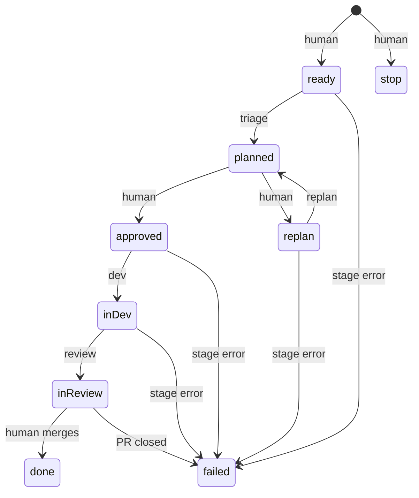

# Pipeline

Cue is a state machine over GitHub issue labels. You move issues into `agent:ready`, `agent:approved`, or `agent:replan`. Cue does the rest, then waits for you to merge.

`process` always starts by reconciling merged and closed PRs ([cleanup](/guide/commands#cleanup)), so a merge on GitHub is enough — you do not have to remember a separate "finish" command. `poll` remains an alias for compatibility.

## The human / Cue loop

| Step | Who | Action |
| --- | --- | --- |
| 1 | human | Label an issue `agent:ready` |
| 2 | you | `cue process` — triage posts a plan comment, label becomes `agent:planned` |
| 3 | human | Review the plan comment; if good, swap the label to `agent:approved` |
| 4 | you | `cue process` — dev implements in a git worktree, tests gate the result, a draft PR opens, the review agent comments its verdict, label becomes `agent:in-review` |
| 5 | human | Review and merge the draft PR |

Multiple projects run independently — separate repos, separate labels, separate worktrees. Always run commands from inside the target repo.

## Label state machine

Label names are exact. They appear in code, tests, prompts, and on real repos — change all or none.

| Label | Meaning | Who sets it | Next actor |
| --- | --- | --- | --- |
| `agent:ready` | Maintainer wants the pipeline to pick this up | human | Cue → triage |
| `agent:planned` | Plan posted as an issue comment | Cue | human reviews plan |
| `agent:approved` | Human approved the plan | human | Cue → dev |
| `agent:replan` | Human wants a revised plan (feedback in comments) | human | Cue → replan |
| `agent:in-dev` | Dev stage claimed and running | Cue | Cue |
| `agent:in-review` | Draft PR open, review loop done | Cue | human merges |
| `agent:done` | PR merged; worktree/branch cleaned up | Cue (cleanup) | — |
| `agent:failed` | A stage failed, or the PR was closed unmerged | Cue | human |
| `agent:stop` | Kill switch — Cue skips this issue everywhere | human | — |

A crashed run leaves an issue stuck in `agent:in-dev`. [`cleanup`](/guide/commands#cleanup) (which every `process` runs first) resets claims older than [`staleClaimMinutes`](/guide/config#fields) to `agent:approved` automatically; reset the label by hand only if you want to retry sooner.

## Giving feedback on a plan

Two ways, from lightest to heaviest:

1. **Ask the agent to revise (recommended).** Reply to the issue with normal comments ("find a simpler approach", "don't add a framework"), then apply the `agent:replan` label. The next `process` re-runs triage with the previous plan and your feedback in context — it may also search the web for alternatives — and posts a revised plan (with a `## Revision notes` section). Repeat as many rounds as you like, then apply `agent:approved`.
2. **Edit the plan yourself.** Edit the plan comment directly, or post a new comment containing the `<!-- cue:plan -->` marker. The newest marker comment wins.

Plain reply comments are only read during a replan. The dev agent sees just the final plan.

## What each stage does & why

Each stage in Cue is designed around a single principle: **use LLMs inside the nodes, plain deterministic code between the nodes.**

### 1. Triage (Read-Only Planning)
- **What it does**: Reads the issue description, explores the codebase in read-only mode, and posts a comprehensive implementation plan comment marked with `<!-- cue:plan -->`. The issue is labeled `agent:planned`.
- **Why**: Coding agents often fail or choose suboptimal architectures when they immediately start writing code. Forcing an explicit planning step ensures architectural clarity and lets humans review the approach before a single file is edited.

### 2. Replan (Iterative Feedback)
- **What it does**: When you comment on an issue and swap the label to `agent:replan`, Cue runs the agent with your feedback, previous plans, and optionally web search to revise the plan.
- **Why**: Allows natural conversation and critique directly in GitHub comments until you are satisfied with the proposed changes.

### 3. Dev (Worktree Implementation)
- **What it does**: Creates an isolated git worktree at `~/.cue/worktrees/<owner>-<repo>/issue-<n>` on a fresh branch `agent/issue-<n>`, and executes the implementation stage.
- **Why**: Agents work in an isolated directory so your current working tree and IDE are completely undisturbed. The agent has write access only inside the worktree; the runner itself manages commits, pushes, and draft PR creation.

### 4. Gate (Deterministic Test & Lint Verification)
- **What it does**: The runner deterministically executes `gate.test` (and optional `gate.lint`) inside the worktree via the system shell.
- **Why**: Pass/fail is never left to LLM self-evaluation. If tests fail, Cue provides the actual compiler/test output back to the agent for one targeted repair attempt. If tests still fail, the stage fails cleanly.

### 5. Review (Automated Verdict & Bounded Fix Loop)
- **What it does**: A fresh reviewer agent inspects the final git diff and posts a structured JSON verdict on the draft PR. If issues are flagged, Cue enters a bounded fix loop (`reviewFixIterations`). Once approved, the issue moves to `agent:in-review`.
- **Why**: Automated dual-pass review catches regressions, leftover debug statements, and missing edge cases before human review.

### 6. Cleanup (Reconciliation & Workspace Hygiene)
- **What it does**: At the start of every `process` run (or via `cue cleanup`), Cue checks PR statuses:
  - **Merged PR** → marks the issue `agent:done` and removes the local worktree and branch.
  - **Closed unmerged PR** → marks the issue `agent:failed` and cleans up the worktree.
- **Why**: Maintainers only need to click "Merge" on GitHub. Cue automatically cleans up disk resources on the next run.

## Safety and Security Model

- **Explicit Opt-in**: Cue only touches issues a repository maintainer has explicitly labeled with `agent:*`.
- **Prompt Injection Defense**: Issue bodies, titles, and comments are treated as untrusted input. Prompts explicitly enforce isolation boundaries.
- **Two Irreversible Human Gates**:
  1. **Plan Approval**: `agent:planned` → `agent:approved`.
  2. **PR Merge**: Cue creates only **draft PRs**. Cue never merges to the base branch and never force-pushes.
- **Scrubbed Environment**: Agent subprocesses receive an allowlisted, scrubbed environment. The `GH_TOKEN` is never passed to agent subprocesses; only Cue's own internal runner uses it.
- **Bounded Resource Caps**: Every stage has max-turn caps (Claude), per-stage timeouts, and a bounded review loop (`reviewFixIterations`). If an issue needs to be halted, applying `agent:stop` acts as an immediate kill switch.
- **Local Audit Logs**: Full transcripts, prompts, token counts, and costs are persisted to `.cue/runs/<issue>/` and viewable via the local dashboard (`cue ui`).
