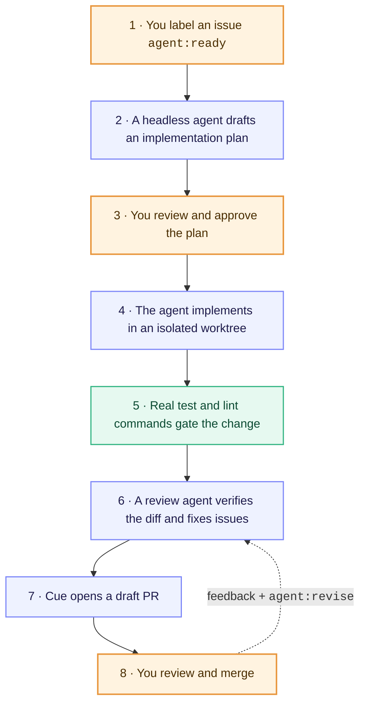

## How it works

Cue turns interactive coding agents into an asynchronous PR factory. Instead of watching an agent type in your terminal, you interact entirely through GitHub issues and pull requests.

  <strong style="color: #e8963d;">Orange</strong> steps are yours — everything in between runs headless.

### Why Cue?

| Interactive Terminal Agents | The Cue Pipeline |
| :--- | :--- |
| **Blocks your terminal**: You babysit streaming output and prompt responses. | **Asynchronous**: Label an issue `agent:ready`, close your laptop, and check back later. |
| **Unchecked architecture**: Agent immediately edits files, sometimes taking the wrong approach. | **Plan approval first**: Agent drafts a plan (`agent:planned`). Implementation only starts once you approve (`agent:approved`). |
| **LLM self-evaluation**: Agent decides subjectively whether its changes work. | **Deterministic gates**: Real test scripts (`bun test`, `npm test`, `pytest`) must pass before a PR is opened. |
| **Dirty working tree**: Agent modifies your active git working copy. | **Worktree isolation**: Agent works in an isolated worktree outside your project root. |
| **Unsafe git operations**: Agents can commit, push, or pollute git history. | **Runner ownership**: Cue owns commits, pushes, and draft PRs; the agent never gets `GH_TOKEN`. |

